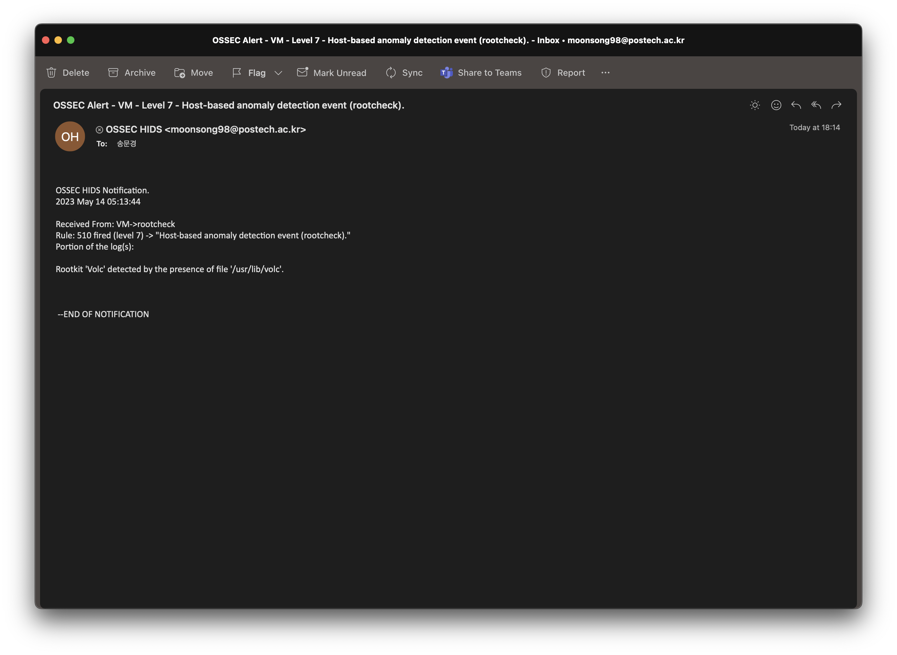

# Project 5

## Task 1: Install OSSEC

OSSEC is one of the well known open-source host-based IDS.
It analyzes the system and provides logs to detect misuses of system etc.
It helps to detect intrusion to the system.

### Installation

Installed on Ubuntu 20.04 provided by seed lab.


### Detection

#### Signature-based Detection

OSSEC manages well known rootkits in `src/rootcheck/db/rootkit_files.txt`
[[LINK]](https://github.com/ossec/ossec-hids/blob/master/src/rootcheck/db/rootkit_files.txt).  
AS shown in that file, volc is one of the well known rootkit.  
Since, direct installaion could be endanger my system, I just created a file `/usr/lib/volc`.  
Since then, OSSEC detected it and sent me an email.



#### Anomaly-based Detection

I tested anomaly-based detection by using `EVIL_RABBIT`
[[LINK]](https://github.com/compilepeace/EVIL_RABBIT).  
  
When it is installed, it behaves as below.

- Conceal itself and in general any file specified on the filesystem (including GNOME file manager - nautilus)
- Posses a payload of TCP bind shell which is activated only if a /tmp directory contains a file named .snow\_valley (i.e. /tmp/.snow\_valley).

|  |  |
|:--:|:--:|
|Before Infected|After Infected|

As shown pics above, new connection is established with port num 19999.

OSSEC detected this new connection and sent me an email.


## Task 2: Install Snort

Snort is a packet analysis tool which is used for network traffic analysis.

### Installation

Installed on Ubuntu 20.04 provided by seed lab.


### Modes

#### Sniffer Mode

Following command display the packet data as well as the headers.

``` command
sudo snort -vde
```


#### Packet Logger Mode

Following command record the packets to the disk, if logging directory is specified.  
Snort will automatically know to go into packet logger mode

``` command
sudo snort -dev -l ./log
```


#### NIDS Mode

Following command enable NIDS mode so that each packet would be
recorded by rules given by rules file after -c option.

```
sudo snort -b -l /tmp/snort-log -h 192.168.1.0/24 -c /etc/snort/snort.conf
```


### Detection

#### Signature-based Detection

I tested signature-based detection via DDOS attack.
Direct attack would endanger my system, so I alternatively sent packet whose packet is 15104.  
In ddos.rules, it treats packet whose port is from 15104 as DDOS atack.
I sent a packet via command below

``` command
nc 172.30.1.76 15104
```

Then snort detects it as a DDOS attack.


#### Anomaly-based Detection

To test anomaly based detection, I created a local rule at `/etc/snort/rules/local.rules`.  
When a TCP packet which contains "admin" arrives, it treats as a intrusion.  
Below pics shows the result.

|  |  | 
|:-----:|:-----:|
| Create a Local Rule | Send "Admin" |
|  | |
| Anomaly Detected| |
